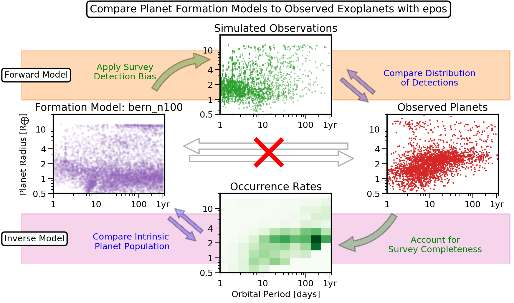

.. epos documentation master file, created by
   sphinx-quickstart on Thu May  3 14:58:08 2018.
   You can adapt this file completely to your liking, but it should at least
   contain the root `toctree` directive.

the Exoplanet Population Observation Simulator
==============================================
   
EPOS is a software package to simulate observations of exoplanet populations. It provides an interface between planet formation simulations and exoplanet surveys such as Kepler, accounting for detection biases in transit and radial velocity surveys.

.. image:: https://img.shields.io/badge/ascl-1909.013-blue.svg?colorB=262255
   :target: http://ascl.net/1909.013

.. image:: https://zenodo.org/badge/132065382.svg
   :target: https://zenodo.org/badge/latestdoi/132065382

Applications
------------

Use EPOS to calculate:

* Planet ocurrence rates (`notebook <tutorials/occurrence_rate.ipynb>`_)
* Planet occurrence rate distributions (`notebook <tutorials/parameteric_mode.ipynb>`_)
* Planetary system architectures (`notebook <tutorials/multiplanet_mode.ipynb>`_)
* Synthetic observations of planet formation models
* Survey biases of transit surveys other than Kepler (`notebook <tutorials/custom_survey.ipynb>`_)
* Planet populations in radial velocity surveys (`notebook <tutorials/radial_velocity.ipynb>`_)
* Binned planet occurrence rates

Install
-------

EPOS is written in Python 3 and hosted on `github  <https://github.com/GijsMulders/epos>`_. 

The quickest way to install epos is via pip:
::

   pip install epospy

.. (possibly preceded by ``sudo -H``)

Getting Started
---------------

Familiarize yourself with the code is to take a look at the :doc:`notebooks`

.. toctree::
   :maxdepth: 2
   :caption: Getting Started

   instructions
   notebooks

.. toctree::
   :maxdepth: 2
   :caption: Tutorials

   tutorials/occurrence_rate.ipynb
   tutorials/parameteric_mode.ipynb
   tutorials/multiplanet_mode.ipynb
   tutorials/radial_velocity.ipynb
   tutorials/custom_survey.ipynb

.. toctree::
   :maxdepth: 2
   :caption: Papers

   papers/fernandes_2019.ipynb
   papers/pascucci_2019.ipynb

.. toctree::
   :maxdepth: 2
   :caption: API Documentation

   api
   modules

License / Attribution
---------------------
Copyright 2018 Gijs Mulders

EPOS was developed as part of the of the `Earths in Other Solar Systems <http://eos-nexus.org/>`_ project, a `NASA/NExSS program <https://nexss.info/>`_

Please cite the papers the two EPOS papers (`Mulders et al. 2018 <https://ui.adsabs.harvard.edu/abs/2018AJ....156...24M>`_; `2019 <https://ui.adsabs.harvard.edu/abs/2019arXiv190508804M>`_) if you use epos. You can also cite the github repository directly

.. image:: https://zenodo.org/badge/DOI/10.5281/zenodo.3515380.svg
   :target: https://doi.org/10.5281/zenodo.3515380
   
List of Publications
--------------------
Mulders et al. 2018 
	`The Exoplanet Population Observation Simulator. I - The Inner Edges of Planetary Systems <https://ui.adsabs.harvard.edu/abs/2018AJ....156...24M>`_
Pascucci et al. 2018 
	`A Universal Break in the Planet-to-star Mass-ratio Function of Kepler MKG Stars <http://adsabs.harvard.edu/abs/2018ApJ...856L..28P>`_
Kopparapu et al. 2018 
	`Exoplanet Classification and Yield Estimates for Direct Imaging Missions <http://adsabs.harvard.edu/abs/2018ApJ...856..122K>`_
Fernandes et al. 2019 
	`Hints for a Turnover at the Snow Line in the Giant Planet Occurrence Rate <http://adsabs.harvard.edu/abs/2018arXiv181205569F>`_
Mulders et al. 2019
	`The Exoplanet Population Observation Simulator. II - Population Synthesis in the Era of Kepler <https://ui.adsabs.harvard.edu/abs/2019arXiv190508804M>`_
Pascucci et al. 2019 
	`The impact of stripped cores on the frequency of Earth-size planets in the habitable zone <https://ui.adsabs.harvard.edu/abs/2019arXiv190806192P>`_

Version Notes:
--------------

:1.0.1: first public release
:1.0.2: pip installable version
:1.1.0: radial velocity without Monte Carlo
:2.0.2: planet formation models |ImageLink|_
:3.0.x: python 3 / jupyter compatible version

.. |ImageLink| image:: https://zenodo.org/badge/DOI/10.5281/zenodo.3515380.svg
.. _ImageLink: https://doi.org/10.5281/zenodo.3515380
   
Indices and tables
------------------

* :ref:`genindex`
* :ref:`modindex`
* :ref:`search`
