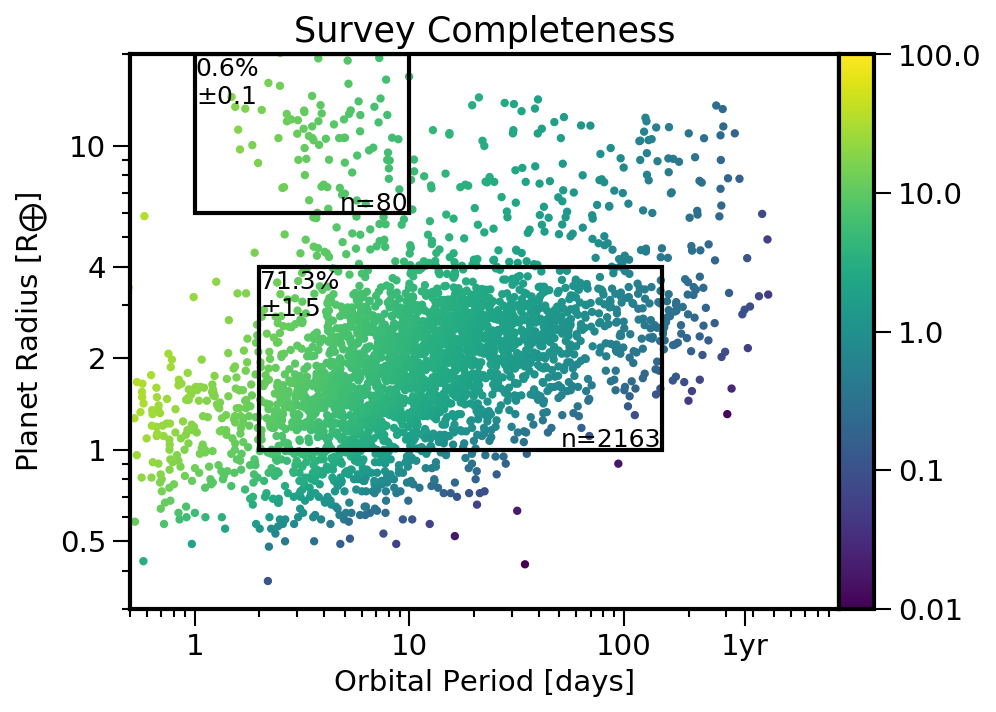
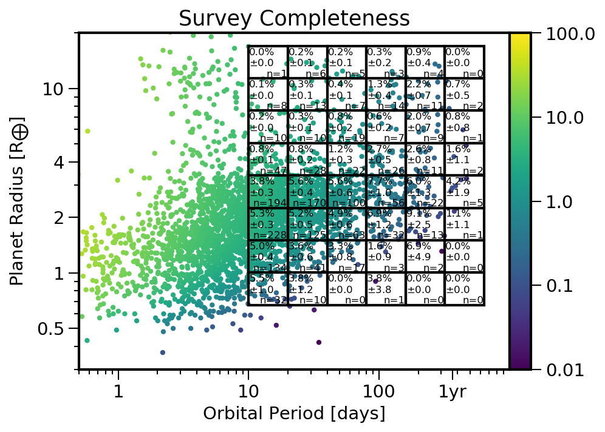

Installation
============

Pip
---

You can install epos with ``pip``:
::

   pip install epospy

Depending on your OS, you might have to use ``sudo`` or:
::

   sudo -H pip install epospy

You should now be able to import the EPOS module into python:

>>> import EPOS

Github
------

Download the source from `github <https://github.com/GijsMulders/epos>`_, preferably using git::

   git clone https://github.com/GijsMulders/epos

You can then do a local install::

   python setup.py sdist
   sudo -H pip install -e .

In the future you can update to the latest version with::

   git pull

Dependencies
------------

EPOS has the following dependencies:

* python 3
* numpy 1.13+
* scipy
* matplotlib 2.0+
* astropy
* tqdm

The following software is required if you want to use the MCMC part of EPOS 

* `emcee <http://dan.iel.fm/emcee>`_ for the MCMC fitting
* `corner.py <(http://corner.readthedocs.io/>`_ for the corner plots

``pip`` should take care of these dependencies automatically but if you installed via ``github`` you will have to install them manually.

Testing
-------
The quickest way to test EPOS is by running the :doc:`notebooks` locally.

To test the basic functionality of EPOS, you can also run the test scripts.
First, copy the test and example scripts to a local directory:

>>> import EPOS
>>> EPOS.scripts.install()
	
Navigate to the scripts directory (``epos-scripts/tests/``) and run each of:
::

   ./test_1_survey.py
   ./test_2_montecarlo.py
   ./test_3_mcmc.py
   ./test_4_multicore.py
   ./test_5_occurrence.py

If you don't have ipython installed, you can also run ``python test_1_survey.py`` or copy-paste the script into a terminal.

Each command is described in the comments, and provides an introduction to the basic functionality. 

Examples
========

There are a number of example scripts included that demonstrate different functionality. The scripts contains comments describing each command.
These scripts are copied to the ``epos-scripts/examples/`` directory by ``EPOS.scripts.install()``.

Parametric mode
---------------
The first example shows how to fit a parametric function in planet radius and orbital period to Kepler data. The script can be run with:
::

   ./example_1_parametric_mode.py

Here, is a step-by-step description of each set of commands.
First, load EPOS and set the output directory name

>>> import EPOS
>>> epos= EPOS.epos(name='example_1')

Second, load the observations (Kepler DR25 planet candidate list) and survey detection efficiency

>>> obs, survey= EPOS.kepler.dr25(Huber=True, Vetting=True, score=0.9)
>>> epos.set_observation(**obs)
>>> epos.set_survey(**survey)

Next, define the parametric distribution function that will be fitted to the data. 
(The example is a broken power-law in both the planet size and distance dimension from fitfunctions.py, but you can define your own)

>>> epos.set_parametric(EPOS.fitfunctions.brokenpowerlaw2D)

Now initialize the fit parameters with their initial values and limits (min, max).
The first parameter is the normalization, defined as the number of planets per star over the simulated radius-period range:

>>> epos.fitpars.add('pps',		2.0, 	min=0)

The next six parameters (one break point and two indices for each dimension) control the shape of the period-radius distribution 

>>> epos.fitpars.add('P break',	10.,	min=2,	max=50,	is2D=True)
>>> epos.fitpars.add('a_P',		1.5, 	min=0,			is2D=True)
>>> epos.fitpars.add('b_P',		0.0,	dx=0.1,			is2D=True)
>>> epos.fitpars.add('R break',	3.0,	min=1.0,max=5, 	is2D=True) 
>>> epos.fitpars.add('a_R',		0.0,	dx=0.1, 		is2D=True)
>>> epos.fitpars.add('b_R',		-4.,	fixed=True, 	is2D=True)

Note that the last parameter is fixed and thus not fitted for. ``dx`` is a parameter that controls the initial distribution of walkers when the inital value is zero.

Next, define the simulation range. 

>>> epos.set_ranges(xtrim=[0,730],ytrim=[0.3,20.],xzoom=[2,400],yzoom=[1,6], Occ=True)

For transits, ``x`` refers to orbital period and ``y`` refers to planet size. The simulated range is that supplied by the detection efficiency grid and trimmed (``trim``) to the given values. For the observational comparison we ``zoom`` in a bit further.

Now we're ready to go!
Run the code once with the initial values:

>>> EPOS.run.once(epos)

Then run the mcmc chain

>>> EPOS.run.mcmc(epos, nMC=1000, nwalkers=100, nburn=200, threads=20, Saved=True)

This runs multi-core with 20 threads. Saved indicates whether the mcmc will be skipped if a previously saved chain is present on disk. ``Saved=False`` always reruns the chain.

Define a set of bins where planet occurrence rates are calculated, both from the data and from integrating the fitted planet distributions, and calculate all the rates

>>> epos.set_bins(xbins=[[2,400],[0.9*365,2.2*365]], ybins=[[1,6],[0.7,1.5]]) # eta_zoom, eta_earth
>>> EPOS.occurrence.all(epos)

Last, plot everything.

>>> EPOS.plot.survey.all(epos)
>>> EPOS.plot.input.all(epos)
>>> EPOS.plot.output.all(epos)
>>> EPOS.plot.mcmc.all(epos)
>>> EPOS.plot.occurrence.all(epos)

Plots will appear in the ``png/example_1/`` subfolder

Multi-planet Mode
-----------------
::

   ./example_2_multiplanet_mode.py

In multi-planet mode, the first planet in the system is drawn from a parametric distribution same as above. However, we adjust the initial guess for the slope after the period break

>>> epos.fitpars.add('b_P',	-1,	max=1,	dx=0.1,	is2D=True)

Next we tell epos to draw additional planets in the system assuming the spacing between adjacent planets is drawn from a dimensionless distribution:

>>> epos.set_multi(spacing='dimensionless')

We generate 10 planets per system.

>>> epos.fitpars.add('npl', 10, fixed=True)

The fit parameters for the dimensionless distribution are:

>>> epos.fitpars.add('log D', -0.3)
>>> epos.fitpars.add('sigma', 0.2, min=0)

Other properties of the planetary systems can also be fit for (or not):

>>> epos.fitpars.add('dR', 0.01, fixed=True) # Dispersion in planet radii
>>> epos.fitpars.add('inc', 2.0) # mode of mutual inclinations
>>> epos.fitpars.add('f_iso', 0.4) # Fraction of isotropic systems
>>> epos.fitpars.add('f_cor', 0.5, fixed=True) # Correlated noise

Then proceed as in single-planet mode.

Planet Formation Mode
---------------------

Example 3 is a template for using EPOS with a planet formation / population synthesis model.

::

   ./example_3_population_synthesis.py

Generate some random data in the same format as the outcome of a planet formation model. (These are 77 systems with 8 planets each)

>>> n= 616
>>> sma= 10.**np.random.uniform(-1.3,1,n)
>>> mass= 10.** (3.*np.random.power(0.5, n))
>>> radius= 10.** np.random.power(0.5, n)
>>> inc= np.random.rayleigh(2, n)
>>> starID= np.repeat(np.arange(n/8), 8)

Load the planet formaton model into EPOS as a dictionary:

>>> pfm= {'sma':sma, 'mass':mass,'radius':radius, 'inc':inc, 'starID':starID}
>>> epos.set_population('Planet Formation Model', **pfm)

Set 1 in 5 stars to have planetary systems

>>> epos.fitpars.add('eta', 0.2, isnorm=True) 

Optionally, use a mass-radius relation if the model does not simulate planetary radii:

>>> epos.set_massradius(EPOS.massradius.CK17, 'Chen & Kipping 2017', masslimits=[0.1,100])

Define a polygonic bin for mini-Neptunes

>>> xmin, xmax= 3, 200
>>> ymin, ymax= 1.2, 4
>>> xb, yb= 100, 2.2
>>> xyMN= [[xmin,ymax],[xmax,ymax],[xmax,ymin], [xb,ymin], [xmin,yb]]
>>> epos.set_bins_poly([xyMN], 
  labels=['Mini-\nNeptunes')

Then run epos and save/plot as usual

>>> EPOS.run.once(epos)
>>> EPOS.occurrence.all(epos)
>>> EPOS.plot.survey.all(epos)
>>> EPOS.plot.input.all(epos, imin=1e-4, color='C8')
>>> EPOS.plot.occurrence.all(epos, color='C8', alpha_fac=50.)
>>> EPOS.plot.output.all(epos, color='C8')

Radial Velocity Surveys
-----------------------
Example 5 shows how to estimate the distribution of planets from a radial velocity survey:

::

   ./example_5_radial_velocity.py

Two commands are different from fitting a transit survey:
First, tell epos that we are doing a radial velocity survey (RV=True), that we are not doing the Monte Carlo simulation (MC=False) and that we are fitting for the planet mass distribution (Msini=True)
   
>>> epos= EPOS.epos(name='example_5', RV=True, MC=False, Msini=True)

Second, we define the radial velocity survey data, here from Mayor+ 2011

>>> obs, survey= EPOS.rv.Mayor2011()
>>> epos.set_observation(**obs)
>>> epos.set_survey(**survey)

Planet Ocurrence Rates
----------------------

Example 9 shows how to estimate occurrence rates using the inverse detection efficiency method. You can run the entire script with:
:: 

   ./example_9_occurrence_rate_inverse.py

Here, is a step-by-step description of each set of commands.
First, load EPOS and set the output directory name

>>> import EPOS
>>> epos= EPOS.epos(name='example_9')

Second, load the observations (Kepler DR25 planet candidate list) and survey dectetion efficiency

>>> obs, survey= EPOS.kepler.dr25(Huber=True, Vetting=True, score=0.9)
>>> epos.set_observation(**obs)
>>> epos.set_survey(**survey)

Next, define the occurrence rate bins for hot Jupiters and super-earths/mini-Neptunes:

>>> x_HJ= [1,10] # Orbital period range in days
>>> y_HJ= [7,20] # Planet size range in earth radii
>>> x_SEMN, y_SEMN= [2,150],[1.0,4.0] # super-Earths/mini-Neptunes
>>> epos.set_bins(xbins=[x_HJ, x_SEMN], ybins=[y_HJ, y_SEMN])

The rates are then calculated, plotted, and saved

>>> EPOS.occurrence.all(epos)
>>> EPOS.save.occurrence(epos)
>>> EPOS.plot.occurrence.all(epos)

The output appears in ``png/occurrence/bins.png`` and should look like this:

Alternatively, you can generate a 1D or 2D grid of bins, for example the SAG13 grid:

>>> import numpy as np
>>> epos.set_bins(xgrid=np.geomspace(10,640,7), 
   ybins=np.geomspace(0.67,17,9), Grid=True)

FAQ
===

Frequently asked questions
--------------------------

If you have any difficulties or questions running EPOS that are not addressed in the documentation or FAQ please contact gdmulders@gmail.com

I'm getting an AttributeError: 'module' object has no attribute 'geomspace'
^^^^^^^^^^^^^^^^^^^^^^^^^^^^^^^^^^^^^^^^^^^^^^^^^^^^^^^^^^^^^^^^^^^^^^^^^^^

Please upgrade to numpy 1.13 or a more recent version

